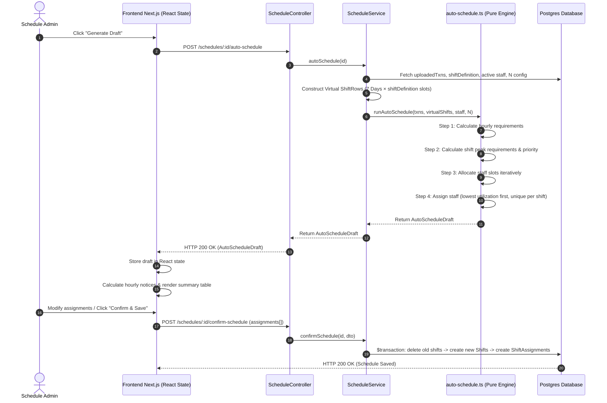

# Auto-Schedule Algorithm & Architecture Documentation

This document provides a comprehensive technical reference for the **Auto-Schedule** feature in the Staff Scheduling System, covering the algorithm design, data structures, execution flow, variable meanings, frontend capacity calculation, and edge case handling.

---

## 1. Overview & Architecture

The Auto-Schedule feature automatically assigns staff to shift slots based on transaction demand proxy data uploaded via CSV, respecting staff weekly working hour caps (`maxWeeklyHours`) and workload balancing constraints.

### Key Architectural Principles:

1. **Stateless Engine**: The backend `runAutoSchedule` algorithm is a pure, deterministic function. Generating an auto-schedule draft performs **zero database writes**.
2. **Virtual Shifts from Shift Definition**: Auto-scheduling generates virtual shifts for all 7 days of the week (`MONDAY` through `SUNDAY`) based on the schedule's `shiftDefinition` JSON (e.g. `07:00–15:00` and `15:00–23:00`). It does not require pre-existing rows in the `shift` database table.
3. **Frontend Draft Review & Editing**: The auto-scheduler returns a draft schedule to the frontend. The user can review, add, or remove staff assignments in React state before persisting.
4. **Client-Side Hourly Notices**: The frontend dynamically calculates hourly capacity alerts (**Under-staffed** vs **Unused Capacity**) for both saved shifts and auto-schedule drafts.
5. **Transactional Persistence**: When the user clicks **Confirm & Save**, a single Prisma `$transaction` deletes existing shifts and assignments for the schedule, creates new `Shift` records in the database `shift` table for all 7 days × defined slots, and inserts the confirmed `ShiftAssignment` records.

---

## 2. Data Flow Architecture



---

## 3. Data Structures & Interfaces

### Backend Domain Types (`BE/src/schedule/types/common.type.ts`)

#### `DayOfWeek`
```typescript
export type DayOfWeek =
  | 'MONDAY' | 'TUESDAY' | 'WEDNESDAY' | 'THURSDAY'
  | 'FRIDAY' | 'SATURDAY' | 'SUNDAY';
```

#### `UploadedTransactions`
Transaction demand data uploaded via CSV for the week.
```typescript
export interface HourlyTransaction {
  hour: string;        // Format: 'HH:mm' (e.g. '07:00')
  transactions: number; // Integer >= 0
}

export interface UploadedTransactions {
  version: 1;
  days: Record<DayOfWeek, HourlyTransaction[]>;
}
```

### Backend Domain Types (`BE/src/schedule/auto-schedule.ts`)

#### `ShiftRow` (Virtual or DB Shift)
Representation of a shift covering a specific day and time range.
```typescript
export interface ShiftRow {
  id: number;           // Virtual ID (1..N) or DB primary key
  scheduleId: number;
  dayOfWeek: DayOfWeek;
  start: string;        // Format: 'HH:mm' (e.g. '07:00')
  end: string;          // Format: 'HH:mm' (e.g. '15:00')
}
```

#### `StaffRow`
Staff member details from the global pool.
```typescript
export interface StaffRow {
  id: number;
  name: string;
  maxHour: number;      // Max weekly working hours (e.g. 40)
}
```

#### `AllocatedShift`
Intermediate data structure produced during Step 3 (Slot Allocation).
```typescript
export interface AllocatedShift {
  shift: ShiftRow;
  hours: string[];                        // Array of covered hours ['07:00', '08:00', ...]
  duration: number;                       // Duration in hours (end - start)
  hourlyTxns: Record<string, number>;      // Hour -> transaction count
  hourlyRequired: Record<string, number>;  // Hour -> required staff count
  peakRequiredStaff: number;              // Max required staff across covered hours
  allocatedSlots: number;                 // Number of staff slots allocated (0..peakRequiredStaff)
}
```

#### `AutoScheduleDraft`
Final draft structure returned by the auto-schedule engine to the frontend.
```typescript
export interface DraftShiftAssignment {
  shiftId: number;
  staffId: number;
  staffName: string;
}

export interface ShiftDraft {
  shiftId: number;
  dayOfWeek: DayOfWeek;
  start: string;
  end: string;
  peakRequiredStaff: number;
  allocatedSlots: number;
  assignments: DraftShiftAssignment[];
}

export interface AutoScheduleDraft {
  shifts: ShiftDraft[];
  totalStaffHoursUsed: number;
  totalStaffHoursAvailable: number;
}
```

---

## 4. Detailed Algorithm Step-by-Step

### Step 1: Hourly Staff Requirement Calculation
**Function**: `calculateHourlyRequirement(transactions: number, n: number): number`

- **Formula**:
  $$\text{requiredStaff} = \max\left(1, \left\lceil \frac{\text{transactions}}{N} \right\rceil\right)$$
- **Logic**:
  - Divides transaction volume by $N$ (where $N = \text{TRANSACTIONS\_PER\_STAFF\_HOUR}$, default `15`) and rounds up using `Math.ceil`.
  - Enforces a minimum of **1 staff member** for any operating hour, even when transactions $= 0$.
- **Examples ($N=15$)**:
  - `0` txns $\rightarrow \max(1, \lceil 0/15 \rceil) = 1$
  - `10` txns $\rightarrow \max(1, \lceil 10/15 \rceil) = 1$
  - `15` txns $\rightarrow \max(1, \lceil 15/15 \rceil) = 1$
  - `16` txns $\rightarrow \max(1, \lceil 16/15 \rceil) = 2$
  - `31` txns $\rightarrow \max(1, \lceil 31/15 \rceil) = 3$

---

### Step 2: Shift Peak Requirement & Priority Logic
**Function**: `buildShiftWithPriority` & `compareByPriority`

For each shift slot (e.g., `MONDAY 07:00–15:00`):
1. **Covered Hours**: Generates the list of 1-hour slots `['07:00', '08:00', ..., '14:00']`.
2. **Hourly Requirement**: Calculates `hourlyRequired[h]` for each covered hour using Step 1.
3. **Peak Required Staff**:
   $$\text{peakRequiredStaff} = \max_{h \in \text{hours}} (\text{hourlyRequired}[h])$$

#### Priority Evaluation Rules:
When multiple shifts compete for available staff-hour capacity, candidate shifts are sorted using the following 3-tier priority rule (lower index = higher priority):

1. **Peak Coverage Ratio (ASC)**:
   $$\text{peakCoverageRatio} = \frac{\text{currentStaffSlots}}{\text{peakRequiredStaff}}$$
   - Shifts with lower coverage relative to their peak demand get allocated first (e.g. $0/4 < 0/2$).
2. **Marginal Coverage Ratio (DESC)**:
   $$\text{marginalCoverageRatio} = \frac{\text{count of hours where } \text{hourlyRequired}[h] > \text{currentStaffSlots}}{\text{shift duration in hours}}$$
   - Among shifts with equal peak coverage ratio, shifts that provide more useful coverage per duration hour win.
3. **Peak Required Staff (DESC)**:
   - Tie-breaker: shifts with larger overall peak demand take precedence.

---

### Step 3: Staff Slot Allocation
**Function**: `allocateStaffSlots(shifts, txnLookup, n, totalCapacity): AllocatedShift[]`

- **Capacity Resource Pool**:
  $$\text{totalCapacity} = \sum_{\text{staff } s} \text{maxHour}[s]$$
- **Iterative Loop**:
  1. Identifies all shifts where $\text{currentStaffSlots} < \text{peakRequiredStaff}$.
  2. Sorts eligible shifts using `compareByPriority`.
  3. Takes the highest priority shift `best`.
  4. If $\text{remainingCapacity} \ge \text{best.duration}$:
     - Increments `best.currentStaffSlots` by 1.
     - Decrements `remainingCapacity` by `best.duration`.
  5. Stops when all shift peak targets are met or available capacity cannot cover another shift slot duration.

---

### Step 4: Staff Assignment & Workload Balancing
**Function**: `assignStaffToShifts(allocatedShifts, staff): { draftShifts }`

1. **Order Shifts**: Sorts `allocatedShifts` ascending by the order of shifts in week (monday am, monday pm, tuesday am, ...).
2. **Track State**:
   - `assignedHours`: `Map<staffId, number>` tracking total hours allocated across the week for each staff member.
   - `assignedStaffIdsInShift`: `Set<staffId>` maintained per shift to **prevent duplicate assignment of the same staff member to the same shift**.
3. **Assignment Loop**:
   For each shift and each allocated slot ($0 \dots \text{allocatedSlots} - 1$):
   - **Filter Eligible Staff**:
     - Staff member $s$ is NOT in `assignedStaffIdsInShift`.
     - $\text{assignedHours}[s] + \text{shiftDuration} \le \text{maxHour}[s]$.
   - **Sort Eligible Staff (Workload Balancing)**:
     - Sorts ascending by current utilization ratio:
       $$\text{utilization}(s) = \frac{\text{assignedHours}[s]}{\text{maxHour}[s]}$$
   - **Assign**: Selects `eligibleStaff[0]`, updates `assignedHours`, records `staffId` in `assignedStaffIdsInShift`, and pushes assignment to `draftShifts`.
   - **Shortage Handling**: If `eligibleStaff` is empty, slot assignment stops for that shift (shortage is left unfilled in draft for user review).

---

## 5. Frontend Hourly Capacity Calculation & Warnings

The frontend calculates hourly notices dynamically for both **Saved Assignments** (Tab 1) and **Auto-Schedule Draft** (Tab 2).

### Variables & Inputs (Per Day & Hour Slot):
- $x$: Total number of staff assigned to shifts covering that hour (from shift staff counts).
- $\text{demand}$: Transaction count for that day and hour (from `uploadedTxns`).
- $N$: $\text{TRANSACTIONS\_PER\_STAFF\_HOUR}$ (default `15`).

### Capacity Rules & Conditions:

| Condition | Formula | Status | Description |
|---|---|---|---|
| **Under-staffed** | $\text{demand} > x \times N$ | 🔴 Red Warning | Scheduled staff capacity ($x \times N$) cannot meet transaction demand. Required staff is $\lceil \text{demand} / N \rceil$. Shortage $= \lceil \text{demand} / N \rceil - x$. |
| **Unused Capacity** | $x > \left\lceil \frac{\text{demand}}{N} \right\rceil$ | 🟡 Amber Warning | Scheduled staff ($x$) exceeds the minimum staff needed to cover demand ($\lceil \text{demand} / N \rceil$). Excess $= x - \left\lceil \frac{\text{demand}}{N} \right\rceil$. |
| **Balanced** | Otherwise | 🟢 Normal | Scheduled staff capacity matches demand requirements. |

### Visual Feedback in UI:
1. **Capacity Notices Panel (`HourlyNoticesPanel`)**: Lists all under-staffed and unused capacity hours grouped by alert type with human-readable explanations.
2. **Aggregated Summary Table (`AggregatedSummary`)**:
   - Under-staffed cells are highlighted in **soft red background** (`bg-red-50 text-red-700`).
   - Unused capacity cells are highlighted in **soft amber background** (`bg-amber-50 text-amber-700`).
   - Hovering over highlighted cells reveals an informative tooltip explaining demand vs assigned staff.

---

## 6. Comprehensive Edge Cases Handled

| Category | Edge Case Scenario | Handling & Mitigation |
|---|---|---|
| **Demand** | Zero-transaction operating hour ($0$ txns) | Step 1 enforces $\max(1, \lceil 0/N \rceil) = 1$. Ensures operating hours always receive at least 1 staff member. |
| **Staff Pool** | Total staff hours < peak required demand | Algorithm allocates available capacity to highest priority slots. Unfillable slots trigger under-staffed notices on FE without crashing. |
| **Staff Pool** | Staff member reaching max weekly hours | Filter condition `assignedHours + duration <= maxHour` prevents over-allocation. |
| **Duplicates** | Multiple slots allocated to a single shift | `assignedStaffIdsInShift` Set prevents assigning the same staff member twice to the same shift. |
| **Workload** | Unequal staff max hours (e.g. 40h vs 10h) | Staff selection sorts by utilization ratio ($\text{assignedHours} / \text{maxHour}$), balancing relative workload. |
| **File Import** | CSV file containing UTF-8 BOM or mixed CRLF | `parseAndNormalizeCsv` strips `\uFEFF` BOM and normalizes `\r\n` / `\r` line endings. |
| **Data Integrity** | Draft shifts modified on FE before confirm | Confirmation endpoint (`POST /confirm-schedule`) operates in a single Prisma `$transaction` (delete old shifts $\rightarrow$ create new `Shift` rows $\rightarrow$ create `ShiftAssignment` rows). |
| **Validation** | Shift definition gaps or overlaps | `validateAndSortShiftDefinition` rejects definitions with gaps, overlaps, or boundaries outside 07:00–23:00 with HTTP 400. |

---

## 7. Key Function Mapping Reference

### Backend (`BE/src/schedule/`)
- **`auto-schedule.ts`**:
  - `calculateHourlyRequirement(transactions, n)`: Computes required staff per hour.
  - `allocateStaffSlots(shifts, txnLookup, n, totalCapacity)`: Iteratively allocates capacity to shift slots.
  - `assignStaffToShifts(allocatedShifts, staff)`: Assigns staff members using lowest-utilization sorting.
  - `calculateAggregatedSummary(txns, shiftStaffCounts)`: Computes aggregated weekly & hourly cell metrics.
  - `runAutoSchedule(txns, shifts, staff, n)`: Main entry point for the scheduling engine.
- **`schedule.service.ts`**:
  - `autoSchedule(id)`: Prepares virtual shifts for 7 days × `shiftDefinition` slots and invokes `runAutoSchedule`.
  - `confirmSchedule(id, dto)`: Replaces database shifts and assignments atomically.
- **`schedule.repository.ts`**:
  - `replaceScheduleShiftsAndAssignments(scheduleId, shiftDefinition, assignments)`: Prisma `$transaction` helper.

### Frontend (`FE/src/app/(admin)/schedules/[id]/shifts/page.tsx`)
- `calculateHourlyNotices(txnDays, shiftStaffCounts, N)`: Computes under-staffed and unused capacity notices.
- `HourlyNoticesPanel({ notices })`: Renders the alerts panel.
- `AggregatedSummary({ txnDays, shiftStaffCounts })`: Renders weekly totals and cell-highlighted summary table.
- `DraftReviewPanel`: Renders editable draft shift cards with staff select dropdowns.
